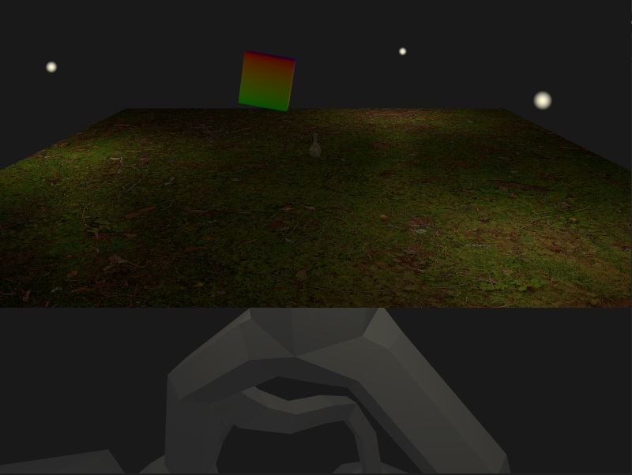
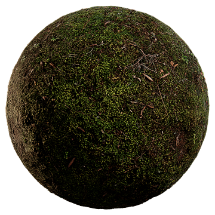

This engine originally followed the tutorial series https://www.youtube.com/playlist?list=PL8327DO66nu9qYVKLDmdLW_84-yE4auCR

MultiSampling anti-aliasing implemented from: 
https://vulkan-tutorial.com/Multisampling

textures implemented from : 
https://vulkan-tutorial.com/Texture_mapping/Images
https://vkguide.dev/docs/chapter-5/drawing_images/
https://www.youtube.com/watch?v=lbaHrocxQdM

textures are currently binded in an array

There exists a way to implement textrures without binding which seems more flexible.

Screenshots impletmented from :
https://github.com/SaschaWillems/Vulkan/blob/master/examples/screenshot/screenshot.cpp
https://reference.torque3d.org/coding/file/swizzle_8h/

PBR materials inspired from :
https://vulkanppp.wordpress.com/2017/07/06/week-6-normal-mapping-specular-mapping-pipeline-refactoring/

uses a series of maps to apply different lighting across a texture

fun finds:
https://www.youtube.com/watch?v=eED4bSkYCB8
https://www.youtube.com/watch?v=ajv46BSqcK4
https://www.youtube.com/watch?v=h7apO7q16V0
https://www.khronos.org/collada/

TO DO:
shadows
skybox
screenshot - current objective
ECS
UI
Sound
Physics

Depends on:
    Vulkan SDK
    stb - https://github.com/nothings/stb
    glfw
    glm
    tinyobjloader
    
This is becoming more and more useful: https://vulkan.gpuinfo.org/displayreport.php?id=25342#formats_optimal