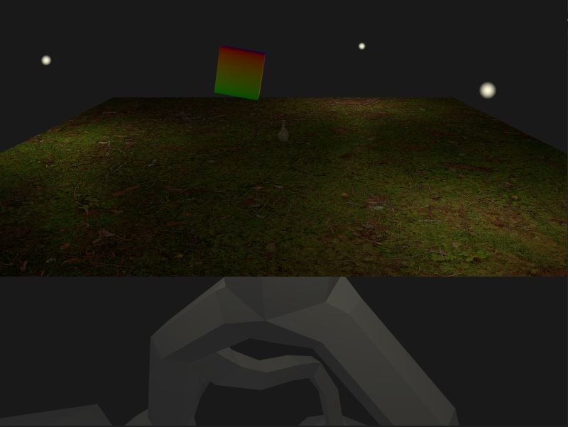

This engine originally followed the tutorial series https://www.youtube.com/playlist?list=PL8327DO66nu9qYVKLDmdLW_84-yE4auCR

MultiSampling anti-aliasing implemented from: 
https://vulkan-tutorial.com/Multisampling

textures implemented from : 
https://vulkan-tutorial.com/Texture_mapping/Images
https://vkguide.dev/docs/chapter-5/drawing_images/
https://www.youtube.com/watch?v=lbaHrocxQdM

textures are currently binded in an array

There exists a way to implement textrures without binding which seems more flexible.
PBR materials inspired from :
https://vulkanppp.wordpress.com/2017/07/06/week-6-normal-mapping-specular-mapping-pipeline-refactoring/

uses a series of maps to apply different lighting across a texture

Screenshots impletmented from :
https://github.com/SaschaWillems/Vulkan/blob/master/examples/screenshot/screenshot.cpp
https://reference.torque3d.org/coding/file/swizzle_8h/

physics inspired from:
https://www.realtimerendering.com/intersections.html
https://www.youtube.com/watch?v=eED4bSkYCB8&t=62s
I discovered Nvidia Physx, but I dont think I can implement it without completely transitioning to visual studio and I dont want to do that.
However I think I can use it's documentation to help me out:
https://gameworksdocs.nvidia.com/PhysX/4.0/documentation/PhysXGuide/Manual/Index.html
http://blog.virtualmethodstudio.com/2017/11/physics-101-3-solvers/

I'm taking a break from physics to do clouds

Atmosphere and clouds:
https://www.youtube.com/watch?v=8OrvIQUFptA
horizon: zero dawn has a lot of info 
https://www.youtube.com/watch?v=ToCozpl1sYY
wtf is 'dithering'
wtf is a kilometer
https://sebh.github.io/publications/egsr2020.pdf
http://evasion.imag.fr/~Antoine.Bouthors/research/phd/ 
https://github.com/sebh/UnrealEngineSkyAtmosphere
https://advances.realtimerendering.com/s2019/index.htm

fun finds:
https://www.youtube.com/watch?v=eED4bSkYCB8
https://www.youtube.com/watch?v=ajv46BSqcK4
https://www.youtube.com/watch?v=h7apO7q16V0
https://www.khronos.org/collada/
http://web.mit.edu/djwendel/www/weblogo/shapes/

Turns out, I could/should set up an arbitrary amount of discriptor sets based on how frequently they change. eg. per camera, per object, per frame
maybe not
https://www.reddit.com/r/vulkan/comments/4gvmus/best_way_for_textures_in_shaders/
first comment knows whats up ^
https://stackoverflow.com/questions/42214710/vkallocatedescriptorsets-returns-vk-out-of-host-memory
I think I am fragmenting my pool.
I think that each update frequency might need its own pool.

Still have to look into:
Descriptor indexing
Push descriptors
bindless descriptors
dynamic UBO's 

https://www.saschawillems.de/blog/2018/09/05/vulkan-conditional-rendering/
https://www.saschawillems.de/blog/2016/08/13/vulkan-tutorial-on-rendering-a-fullscreen-quad-without-buffers/

TO DO:
shadows
skybox
ECS
UI
Sound
Physics - current objective

Depends on:
    Vulkan SDK
    stb - https://github.com/nothings/stb
    glfw
    glm
    tinyobjloader
    
This is becoming more and more useful: https://vulkan.gpuinfo.org/displayreport.php?id=25342#formats_optimal
built in variables for frag shaders: https://www.khronos.org/opengl/wiki/Fragment_Shader