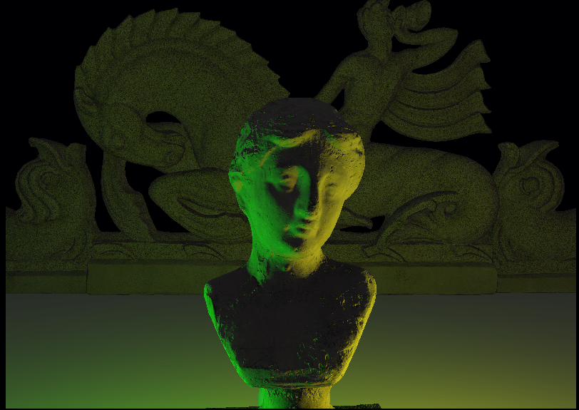
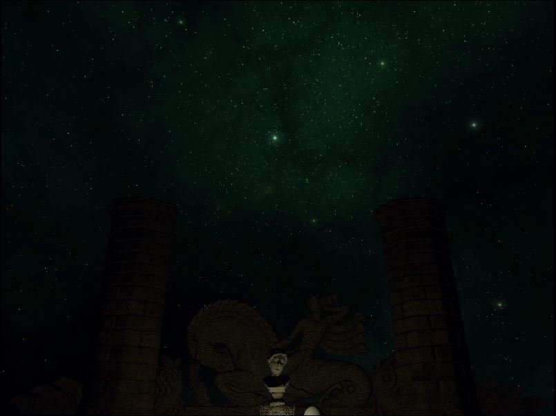
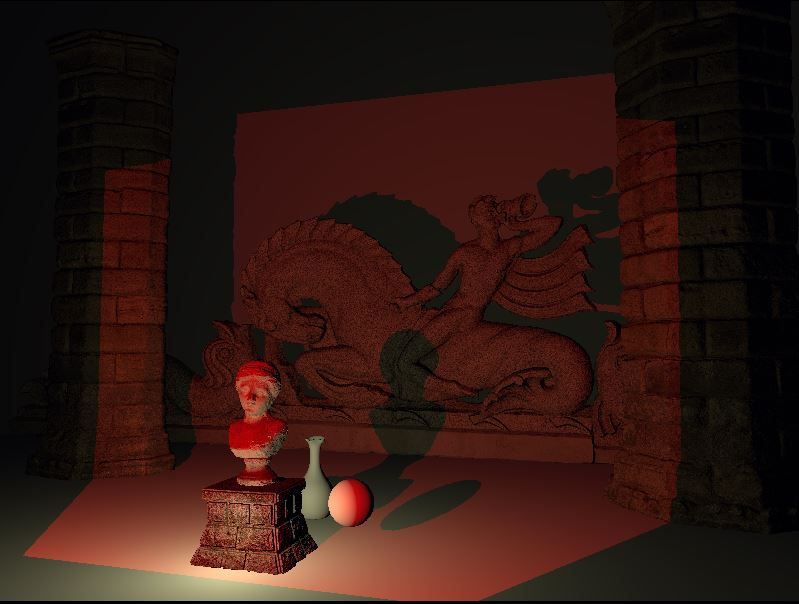
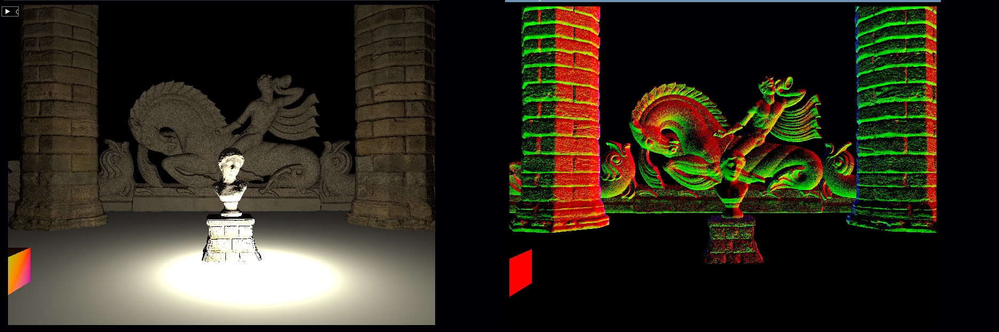

# Introduction

This project is dedicated to the development of a custom game engine, focusing on the exploration and implementation of advanced rendering techniques and physics simulations. The initiative stems from a desire to deeply understand the mechanics behind game engines and to apply this knowledge in creating visually rich and interactive scenes. While navigating the complexities of game engine architecture, this project also serves as a practical learning journey, aiming to bridge theoretical concepts with real-world application.

## Scripting API
The engine can now run scripts attached to game objects. The scripting engine uses Mono and scripts can currently process user input and access the properties of the parent entity.

### Parameters

- Object.Transform: This struct mirrors the transform component of the parent entity and the values of the translation and rotation are refleted in the scene. (Except scale atm)

### Functions

- isButtonDown(key): This function returns true if the key in question is currently pressed

## Features TODO

### Physics engine

Sources:

- <https://www.realtimerendering.com/intersections.html>
- <https://www.youtube.com/watch?v=eED4bSkYCB8&t=62s>

- I discovered Nvidia Physx, but I rather try making my own. However I think I can use it's documentation to help me out:

  - <https://gameworksdocs.nvidia.com/PhysX/4.0/documentation/PhysXGuide/Manual/Index.html>
  - <http://blog.virtualmethodstudio.com/2017/11/physics-101-3-solvers/>

### Fun Finds

- <https://www.youtube.com/watch?v=eED4bSkYCB8>
- <https://www.youtube.com/watch?v=ajv46BSqcK4>
- <https://www.youtube.com/watch?v=h7apO7q16V0>
- <https://www.khronos.org/collada/>
- <http://web.mit.edu/djwendel/www/weblogo/shapes/>
- <https://www.saschawillems.de/blog/2018/09/05/vulkan-conditional-rendering/>
- <https://www.saschawillems.de/blog/2016/08/13/vulkan-tutorial-on-rendering-a-fullscreen-quad-without-buffers/>

- <https://vcpkg.io/en/>
- <https://www.alexhyett.com/stack-vs-heap-memory/>
- <https://www.youtube.com/watch?v=NRnj_lnpORU>
- <https://jose-villegas.github.io/post/deferred_voxel_shading/>
- <http://www.codinglabs.net/>
- <http://alexcpeterson.com/spacescape/>
- <http://www.cemyuksel.com/research/>
- it seems Cem Tuskel is a total chad  
- <https://taidaesal.github.io/vulkano_tutorial/>
- <https://raytracing-docs.nvidia.com/mdl/api/mi_neuray_example_df_vulkan.html>
- <https://www.youtube.com/@GetIntoGameDev/featured>
- <https://www.reddit.com/r/IndieDev/comments/1735ofe/where_to_get_free_assets_for_game_cco/> assets

### Atmosphere and clouds

Sources:

- <https://www.youtube.com/watch?v=8OrvIQUFptA>
- horizon: zero dawn has a lot of info
  - <https://www.youtube.com/watch?v=ToCozpl1sYY>

> wtf is 'dithering'
> wtf is a kilometer

- <https://sebh.github.io/publications/egsr2020.pdf>
- <http://evasion.imag.fr/~Antoine.Bouthors/research/phd/>
- <https://github.com/sebh/UnrealEngineSkyAtmosphere>
- <https://advances.realtimerendering.com/s2019/index.htm>
- <https://onlinelibrary.wiley.com/doi/10.1111/cgf.15010>
Schneegans, S., Meyran, T., Ginkel, I., Zachmann, G. and Gerndt, A. (2024), Physically Based Real-Time Rendering of Atmospheres using Mie Theory. Computer Graphics Forum, 43: e15010. https://doi.org/10.1111/cgf.15010
- <https://stackoverflow.com/questions/4007589/multithreading-an-opengl-winapi-application>

### Vulkan resources

This is becoming more and more useful:
<https://vulkan.gpuinfo.org/displayreport.php?id=25342#formats_optimal>
built in variables for frag shaders:
<https://www.khronos.org/opengl/wiki/Fragment_Shader>

## dependencies

- Vulkan SDK- <https://www.vulkan.org/>
- stb - <https://github.com/nothings/stb>
- glm - <https://github.com/g-truc/glm>
- tinyobjloader - <https://github.com/tinyobjloader/tinyobjloader>
- imgui(legacy) - <https://github.com/ocornut/imgui.git>
- Mono - <https://www.mono-project.com/>
- Assimp 5.4.2 <https://github.com/assimp/assimp>

I started this engine following [Vulkan (c++) Game Engine Tutorials](https://www.youtube.com/playlist?list=PL8327DO66nu9qYVKLDmdLW_84-yE4auCR) by Brendan Galea. This was intrumental on getting the ball rolling and I am very grateful that he took the time to make the series.
